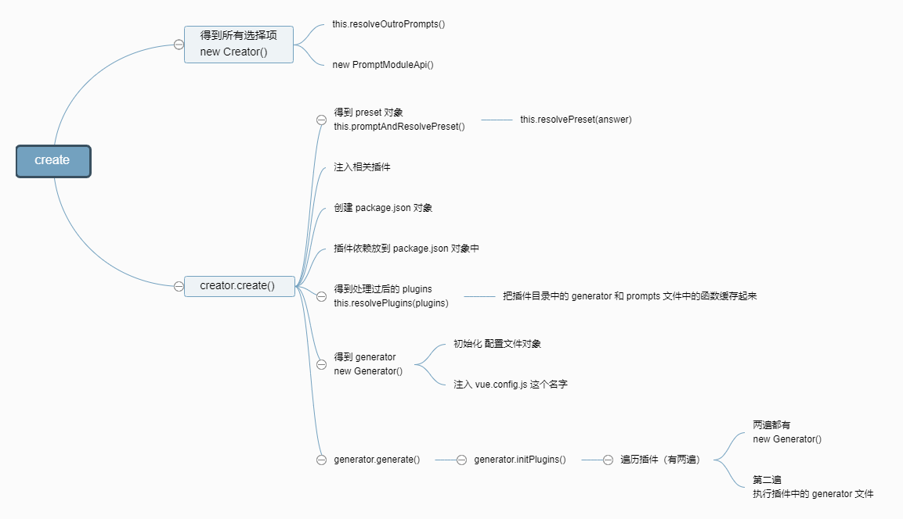

## 引用本地图片

```md
相对路径


路径别名

```


## 项目内链接

```md
[Home](/) <!-- 跳转到根部的 README.md -->
[foo](/foo/) <!-- 跳转到 foo 文件夹的 index.html -->
[foo heading](./#heading) <!-- 跳转到 foo/index.html 的特定标题位置 -->
[bar - three](../bar/three.md) <!-- 具体文件可以使用 .md 结尾（推荐） -->
[bar - four](../bar/four.html) <!-- 也可以用 .html -->
```

## 表格

```md
| Tables        | Are           | Cool  |
| ------------- |:-------------:| -----:|
| col 3 is      | right-aligned | $1600 |
| col 2 is      | centered      |   $12 |
| zebra stripes | are neat      |    $1 |
```

## 表情

[emoji](https://github.com/markdown-it/markdown-it-emoji/blob/master/lib/data/full.json)


## 把本文件的标题按照层级展示出来

```md
[[toc]]
```
[[toc]]

## 自定义容器

::: tip
这是一个提示
:::

::: warning
这是一个警告
:::

::: danger
这是一个危险警告
:::

::: 点击展开详情
```js
console.log('Hello, VuePress!')
```
:::

## 流程图

```md
@flowstart
cond=>condition: Process?
process=>operation: Process
e=>end: End

cond(yes)->process->e
cond(no)->e
@flowend
```

@flowstart
cond=>condition: Process?
process=>operation: Process
e=>end: End

cond(yes)->process->e
cond(no)->e
@flowend


